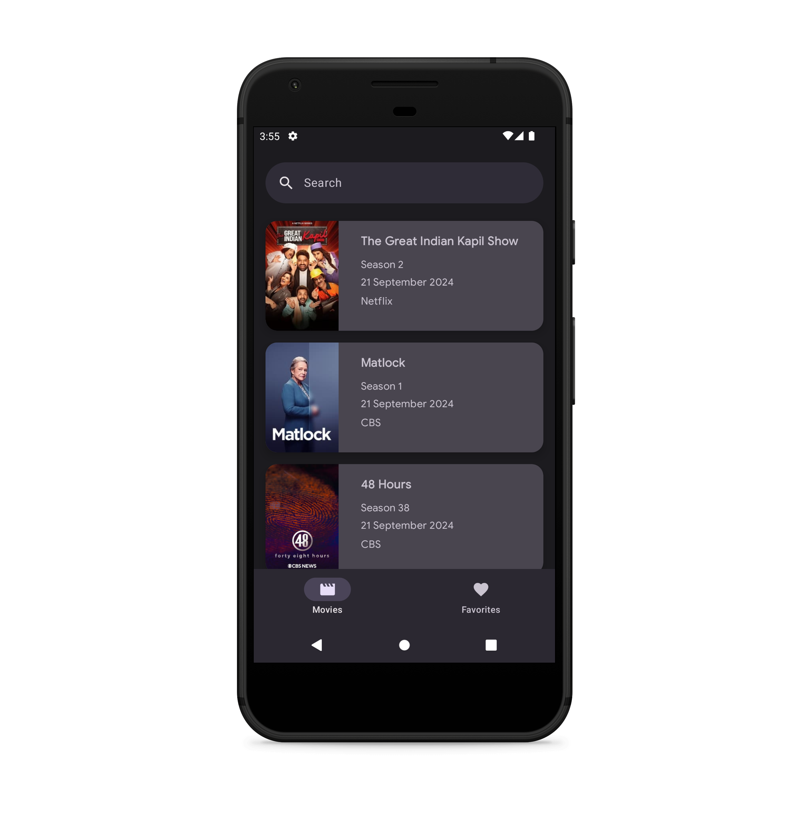
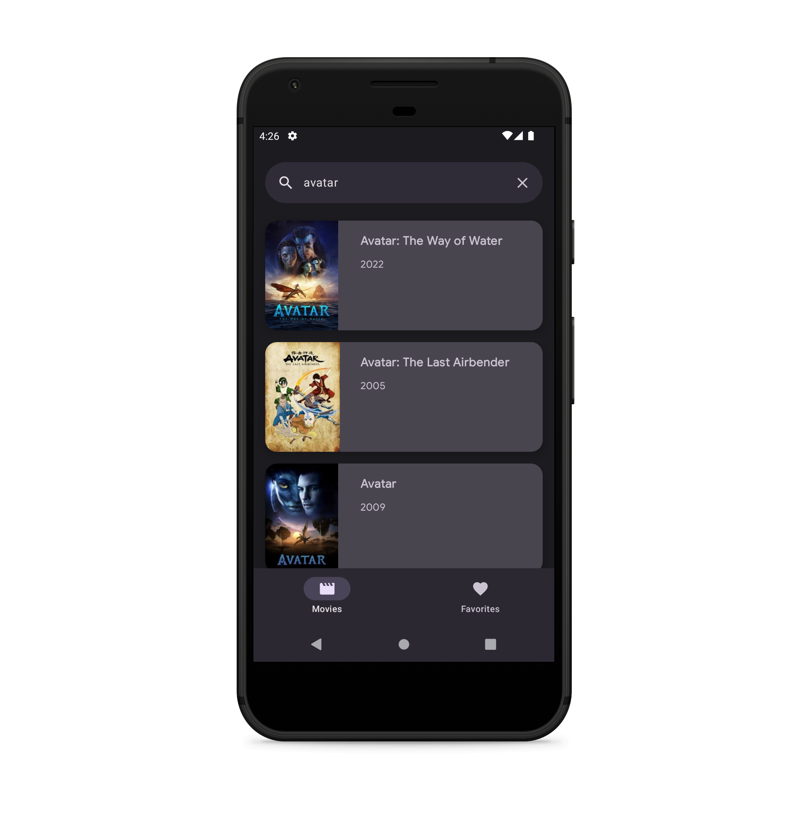
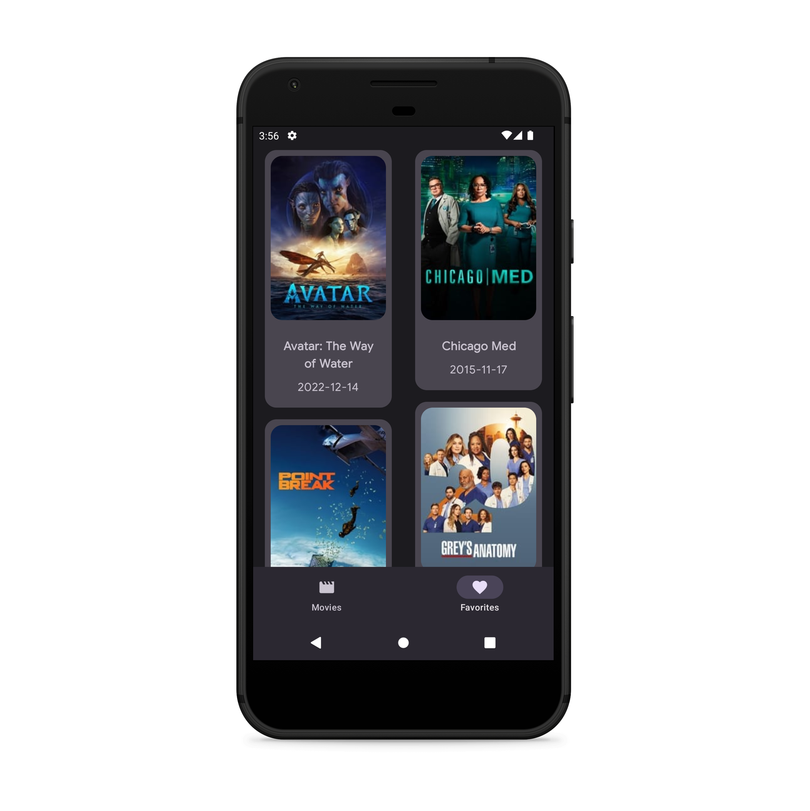

# CI/CD in progress

# MovieApp

## Описание
Приложение для поиска кино и сериалов

## Стек технологий

* Kotlin
* Single Activity
* Jetpack Compose
* MVVM
* Hilt
* Kotlin coroutines
* Многомодульность
* Retrofit + Kotlin Serialization для сетевого взаимодействия
* Room

Для разработки использовалось API [Watchmode](https://api.watchmode.com/)

## Скриншоты

### Список новых фильмов и сериалов

### Поиск

### Детали

### Избранное

